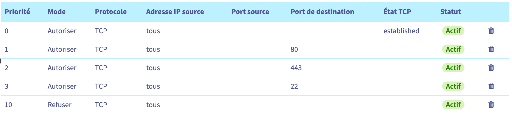
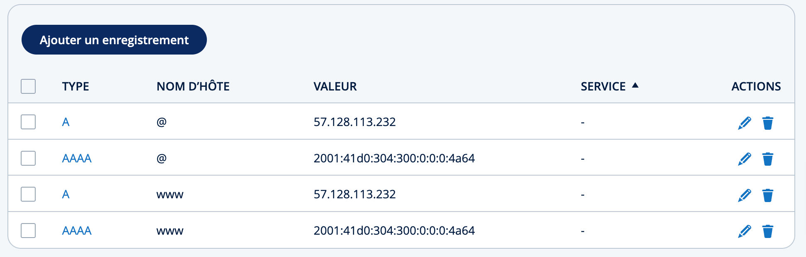
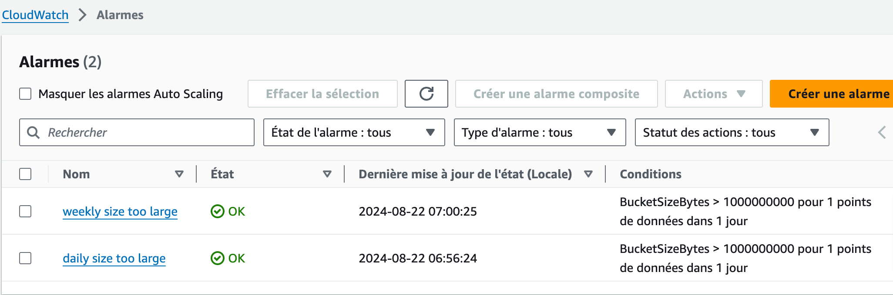

Deployment in production instructions.

## OVH

Create a public cloud instance `discovery` `d2-2` in Gravelines, on public network,
using ubuntu 24.04.1, with a name like `confessio-1`.

Add the following firewall configuration:


Buy a domain and link DNS to your instance IP.


## AWS S3

We use S3 to backup postgresql daily and weekly, as well as to store uploaded documents.

Create three S3 buckets and an IAM user ([tutorial](https://kinsta.com/knowledgebase/amazon-s3-backups/)).
The S3 buckets to create are:
- `confessio-dbbackup-daily`
- `confessio-dbbackup-weekly`
- `confessio-uploaded-documents`

For security reasons, we don't want the IAM user to be able to delete any elements in them.

Here is the policy:
```json
{
    "Version": "2012-10-17",
    "Statement": [
        {
            "Sid": "atbucket",
            "Effect": "Allow",
            "Action": [
                "s3:PutObject",
                "s3:GetObjectAcl",
                "s3:GetObject",
                "s3:ListBucket",
                "s3:GetBucketAcl",
                "s3:PutObjectAcl"
            ],
            "Resource": [
                "arn:aws:s3:::confessio-dbbackup-daily",
                "arn:aws:s3:::confessio-dbbackup-daily/*",
                "arn:aws:s3:::confessio-dbbackup-weekly",
                "arn:aws:s3:::confessio-dbbackup-weekly/*",
                "arn:aws:s3:::confessio-uploaded-documents",
                "arn:aws:s3:::confessio-uploaded-documents/*"
            ]
        },
        {
            "Sid": "overall",
            "Effect": "Allow",
            "Action": [
                "s3:ListAllMyBuckets"
            ],
            "Resource": "*"
        }
    ]
}
```

Also, to enable public download of uploaded documents, you need to set the bucket policy for `confessio-uploaded-documents` to allow public read access:
```json
{
	"Version": "2012-10-17",
	"Statement": [
		{
			"Sid": "PublicReadAllObjects",
			"Effect": "Allow",
			"Principal": "*",
			"Action": "s3:GetObject",
			"Resource": "arn:aws:s3:::confessio-uploaded-documents/*"
		}
	]
}
```

Also, you should add CloudWatch alarms to monitor the buckets size.

In CloudWatch, go to metrics, browse S3 metrics, and for both buckets create an alarm on size. Don't forget to confirm the email subscription in your inbox.


## AWS SES
We use AWS SES to send email.

Here is a policy to add to the IAM user to allow email sending:
```json
{
    "Version": "2012-10-17",
    "Statement": [
        {
            "Sid": "VisualEditor0",
            "Effect": "Allow",
            "Action": [
                "ses:SendEmail",
                "ses:GetSendQuota",
                "ses:SendRawEmail"
            ],
            "Resource": "*"
        }
    ]
}
```

You'll have to verify domain and some email address on SES console.

### AWS CloudWatch

Create a loggroup in AWS CloudWatch called "/metrics/opentelemetry", 
and in it a log stream "confessio-stream".
Create an IAM user "otel-metrics-agent", with "CloudWatchAgentServerPolicy" permissions.
Export the access key and secret key.

You can check the permissions in server by doing :
```shell
sudo su - otel
aws logs put-log-events --log-group-name "/metrics/opentelemetry" --log-stream-name "confessio-stream" --log-events timestamp=$(date +%s%3N),message="Test log event" --region eu-west-3
```

## Run ansible playbook

### Install Ansible dependencies

Install latest grafana.grafana ansible collection:
```
ansible-galaxy collection install grafana.grafana --force
```

### Run playbook

```shell
# first installation of server
./prod.sh install
# after any change of code
./prod.sh deploy
# once and after any cron change
./prod.sh cron
```
This is mainly inspired by https://realpython.com/automating-django-deployments-with-fabric-and-ansible/

### Restore DB backup
```shell
# SSH to server then grant confessio postgresql superuser privilege
# This is required because backup will drop/create postgis extension
sudo -u postgres psql -c "ALTER ROLE confessio SUPERUSER;"
# Drop and recreate database
sudo -u postgres psql postgres -c "DROP DATABASE confessio;" && sudo -u postgres psql postgres -c "CREATE DATABASE confessio;" && sudo -u postgres psql postgres -c "ALTER DATABASE confessio OWNER TO confessio;"
# This will restore last backup
. /home/ubuntu/confessio/.env; /home/ubuntu/envs/confessio/bin/python3.12 /home/ubuntu/confessio/manage.py dbrestore --uncompress
# Revoke superuser access
sudo -u postgres psql -c "ALTER ROLE confessio NOSUPERUSER;"
```